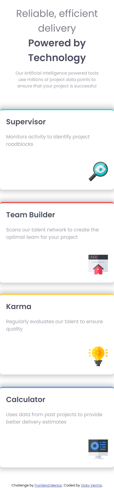

## Table of contents
  - [Screenshot](#screenshot)
  - [Links](#links)
- [My process](#my-process)
  - [Built with](#built-with)
- [Author](#author)


### Screenshot

|  desktopView  |    Mobile_veiw
|---------------| ---------------- |
|               |                  |
||              |


### Links

- Solution URL: [https://github.com/code-nick/Four_card_future_section_master.git]
- Live Site URL: [https://four-card-future-section-master.vercel.app/]

## My process

### Built with

- React js
- SCSS 
- Flexbox
- SCSS Grid
- Mobile-first workflow
- [React](http://localhost:5173/) - JS library


```html
<h1>Some react code I'm proud of</h1>
```
```css
.proud-of-this-scss {
  color: papayawhip;
}
```
```js
const proudOfThisFunc = () => {
  console.log('🎉')
}
```


## Author

- Website - [https://github.com/code-nick]
- Frontend Mentor - [https://www.frontendmentor.io/profile/code-nick]

